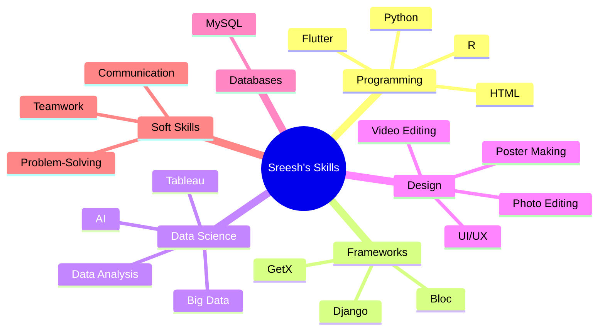

<div align="center">
  
# ✨ Sreesh K Suresh ✨

</div>

<div align="center">

</div>

<br>


## 🚀 About Me

```python
class SreeshKSuresh:
    def __init__(self):
        self.name = "Sreesh K Suresh"
        self.role = "Data Science Student | Flutter Developer"
        self.language_spoken = ["en_US", "Malayalam", "Tamil", "Hindi"]
        self.interests = ["AI/ML", "Mobile Development", "Data Analysis"]
        self.current_focus = "Building innovative solutions with Flutter and ML"

    def say_hi(self):
        print("Thanks for dropping by! Let's connect and build something amazing together!")

me = SreeshKSuresh()
me.say_hi()
```

<div align="center">
  


</div>

## ⚡ Tech Stack

<div align="center">
  


</div>

<div align="center">
  


</div>

<div align="center">



</div>

## 🏆 Achievements

<div align="center">
  


| 🏆 **Competition** | 🎖️ **Award** | 🔍 **Category** |
|:---:|:---:|:---:|
| **TechPlus Hackathon** | **2nd Prize** | *"Best Idea Ignator"* |
| **Hackefx Hackathon** | **3rd Prize** | *Innovation* |

</div>

## 📊 GitHub Stats

<div align="center">
  
<!-- Modified snake animation to autoplay -->


[](https://git.io/streak-stats)


</div>

## 📜 Certifications

<div align="center">
  


| 📄 **Certification** | 🚀 **Skills Gained** | 🔗 **Link** |
|---|---|---|
| Introduction to Flutter | Mobile App Development, Dart | [View](https://www.linkedin.com/in/sreesh-k-suresh/) |
| Python Full Stack Development | Python, Django, Web Development | [View](https://www.linkedin.com/in/sreesh-k-suresh/) |
| GIT | Version Control, Collaboration | [View](https://www.linkedin.com/in/sreesh-k-suresh/) |
| Machine Learning with Python | ML Algorithms, Data Processing | [View](https://www.linkedin.com/in/sreesh-k-suresh/) |
| Data Analysis with Python | Data Visualization, Statistics | [View](https://www.linkedin.com/in/sreesh-k-suresh/) |
| Microsoft Cloud Skills Challenge | Azure, Cloud Computing | [View](https://www.linkedin.com/in/sreesh-k-suresh/) |
| Digital Marketing | SEO, Social Media Marketing | [View](https://www.linkedin.com/in/sreesh-k-suresh/) |
| Python 101 for Data Science | Data Science Fundamentals | [View](https://www.linkedin.com/in/sreesh-k-suresh/) |

</div>

## 🔥 My Contribution Streak

<div align="center">
  <a href="https://github.com/Sreeshks/github-readme-streak-stats">
    
  </a>
</div>

## 📫 Let's Connect!

<div align="center">
  
<a href="https://www.linkedin.com/in/sreesh-k-suresh/" target="_blank">
  
</a>
<a href="https://github.com/Sreeshks" target="_blank">
  
</a>
<a href="mailto:sreeshksureshh@gmail.com">
  
</a>

<br>

[](https://www.linkedin.com/in/sreesh-k-suresh/)
[](https://github.com/Sreeshks)
[](mailto:sreeshksureshh@gmail.com)

</div>

<div align="center">
  


</div>


<div align="center">
  
</div>
